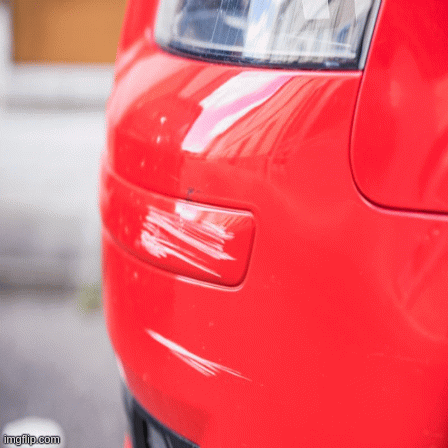
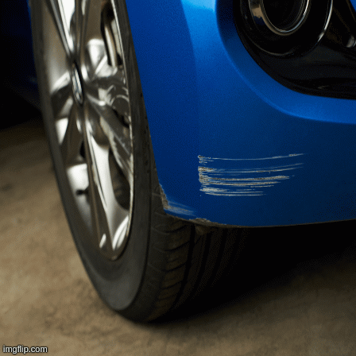
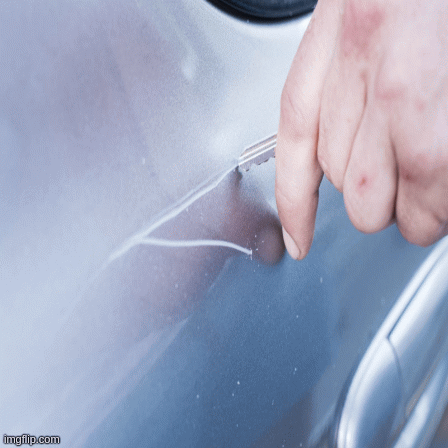
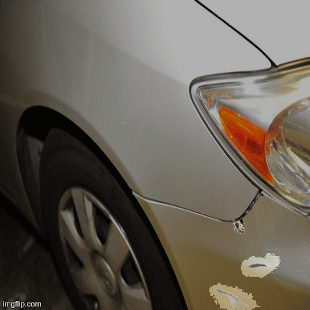

# Car-scratch-segmentation-and-bbox-localization

Task: Segmenting and drawing bou ding boxes around scratches in cars.

Data: 150 images scraped from internet. Most challenging part of this project was availability of just a small amount of data.

Model: Fastai unet learner

Some results:

  

 

## Pre-requisites

Python3 
PyTorch 
FastAI 
OpenCV

